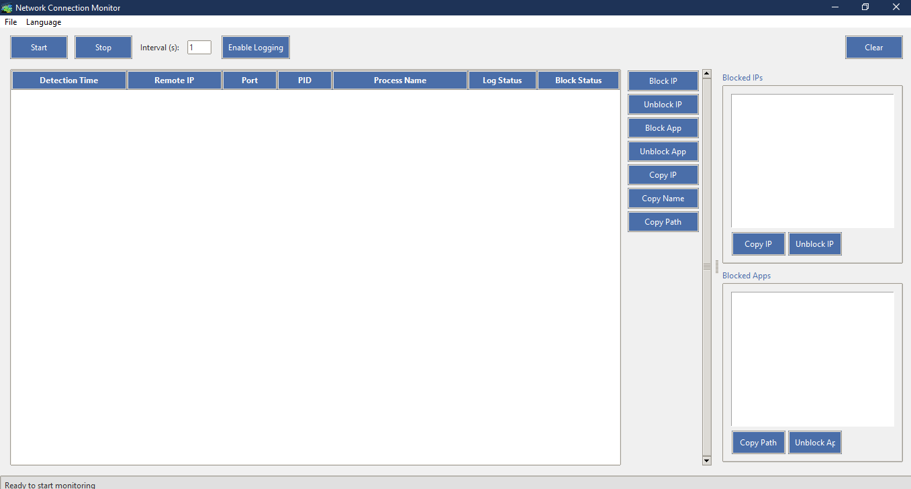

# Network Connection Monitor

 <!-- Add a screenshot if available -->

A Python-based GUI application that monitors network connections, allows blocking/unblocking IPs and applications, and logs connection data.

## Features

- Real-time monitoring of active network connections
- Display connection details (IP, port, PID, process name)
- Block/unblock specific IP addresses
- Block/unblock specific applications
- Copy connection information to clipboard
- Log connection data to CSV file
- System tray integration
- Multi-language support (English, Polish)
- Administrator privileges detection

## Requirements

- Python 3.7+
- Windows OS (for full functionality)

## Installation

- Clone this repository:
- git clone https://github.com/pleomati/network-connection-monitor.git
- cd network-connection-monitor
- Install the required dependencies:
- pip install -r requirements.txt
- Run the application:
- python NetworkAppMonitor.py

## Usage:
- Start Monitoring: Click the "Start" button to begin monitoring network connections.
- Adjust Interval: Set the refresh interval in seconds.
- Block IPs/Apps: Right-click on a connection to block/unblock IPs or applications.
- Logging: Enable logging to save connection data to a CSV file.
- System Tray: Minimize to system tray for background monitoring.

## Command Line Options:
- Run the application with administrator privileges for full functionality (IP/application blocking).

## Configuration:
- Blocked IPs and applications are saved in blocked_ips.json and blocked_apps.json.
- Language can be changed from the menu (English/Polish).

## Troubleshooting:
- If IP/application blocking doesn't work, ensure you're running as administrator.
- Some features require Windows Firewall to be acttive

License
MIT License
